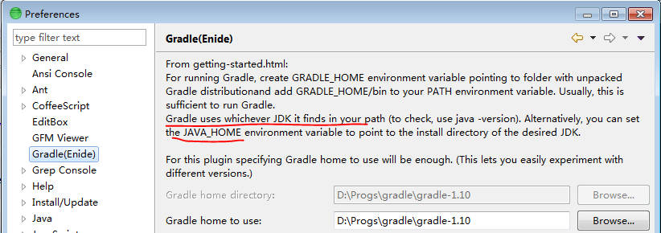
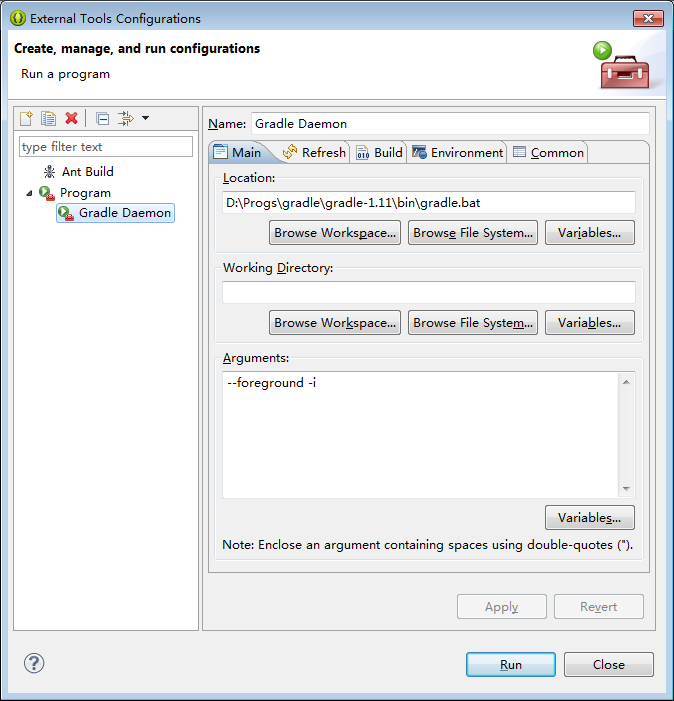
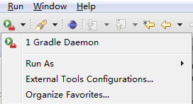

## Creating Gradle project

Finally after comparing all solution, I think starting from `build.gradle` file can be convenient. 

Gradle distribution has `samples` folder with a lot of examples, and there is `gradle init --type basic` comand see [Chapter 47. Build Init Plugin](http://www.gradle.org/docs/1.11/userguide/userguide_single.html#build_init_plugin). But they all needs some editing.

You can use [template](https://github.com/Nodeclipse/nodeclipse-1/blob/master/org.nodeclipse.enide.editors.gradle/docs/java/basic/build.gradle) below as well, then run `gradle initSourceFolders eclipse`

	/*
	* Nodeclipse/Enide build.gradle template for basic Java project
	*	https://github.com/Nodeclipse/nodeclipse-1/blob/master/org.nodeclipse.enide.editors.gradle/docs/java/basic/build.gradle
	* Initially asked on
	*	http://stackoverflow.com/questions/14017364/how-to-create-java-gradle-project
	* Usage
	*	1. create folder (or general Eclipse project) and put this file inside
	*	2. run `gradle initSourceFolders eclipse` or `gradle initSourceFolders idea`
	* @author Paul Verest; 
	* based on `gradle init --type basic`, that does not create source folders 
	*/
	
	apply plugin: 'java'
	apply plugin: 'eclipse'
	apply plugin: 'idea'
	
	task initSourceFolders << {
	   sourceSets*.java.srcDirs*.each { it.mkdirs() }
	   sourceSets*.resources.srcDirs*.each { it.mkdirs() }
	}
	
	task wrapper(type: Wrapper) {
	    gradleVersion = '1.11'
	}
	
	// In this section you declare where to find the dependencies of your project
	repositories {
	    // Use Maven Central for resolving your dependencies.
	    // You can declare any Maven/Ivy/file repository here.
	    mavenCentral()
	}
	
	// In this section you declare the dependencies for your production and test code
	dependencies {
	    //compile fileTree(dir: 'libs', include: '*.jar')
	    // The production code uses the SLF4J logging API at compile time
	    //compile 'org.slf4j:slf4j-api:1.7.5'
	
	    // Declare the dependency for your favourite test framework you want to use in your tests.
	    // TestNG is also supported by the Gradle Test task. Just change the
	    // testCompile dependency to testCompile 'org.testng:testng:6.8.1' and add
	    // 'test.useTestNG()' to your build script.
	    testCompile "junit:junit:4.11"
	}

The result is like below. 

![overview][1]

That can be used without any Gradle plugin for Eclipse,  
or with [(Enide) Gradle for Eclipse, Jetty, Android](http://marketplace.eclipse.org/content/gradle) alternative to [Gradle Integration for Eclipse](http://marketplace.eclipse.org/content/gradle-integration-eclipse)

![editbox][2]

  [1]: http://i.stack.imgur.com/q9RHN.png
  [2]: http://i.stack.imgur.com/ZGOah.png

## org.nodeclipse.enide.gradle

`build.gradle` Run As Gradle GUI

- Minisite <http://www.nodeclipse.org/enide/gradle/>
- GitHub <https://github.com/Nodeclipse/nodeclipse-1/tree/master/org.nodeclipse.enide.gradle>

*Description*:  
Right-click any `.gradle` file, and select `Run As -> Gradle GUI`

To run/execute with gradle add this to `build.gradle`  

	task execute(type:JavaExec) {
	   main = mainClass
	   classpath = sourceSets.main.runtimeClasspath
	}

then execution is via

	gradle execute -PmainClass=runclass.RunClass 

see [Gradle to execute Java class (without modifying build.gradle)](http://stackoverflow.com/questions/21358466/gradle-to-execute-java-class-without-modifying-build-gradle)

### Jetty

As with Maven, your `build.gradle` should have jetty configuration 
to enable `gradle jetty:run` Gradle start.

See [#4 Running from Eclipse plugin](https://github.com/Khoulaiz/gradle-jetty-eclipse-plugin/issues/4)
for [gradle-jetty-eclipse-plugin](https://github.com/Khoulaiz/gradle-jetty-eclipse-plugin)
that has support for jetty 7+

### Daemon

see [Chapter 19. The Gradle Daemon](?), [Appendix D. Gradle Command Line](?)

Use Gradle daemon to speed up sequential gradle execution:

launch `gradle --foreground -i` in a shell or configure Eclipse external tool:

  

### Developing 

1. `git clone`;
2. import this project and `org.nodeclipse.common` (only 2 is enough) in Eclipse with PDE (e.g. Eclipse SDK/Classic)
 as "Existing Projects into Workspace".

maven build is optional for full build with other plugins.

#### Some links

- [When Runtime.exec() won't](http://www.javaworld.com/article/2071275/core-java/when-runtime-exec---won-t.html)

> Because some native platforms only provide limited buffer size for standard input and output streams, 
failure to promptly write the input stream or read the output stream of the subprocess may cause the subprocess to block, and even deadlock.

	"C:\Program Files\Java\jdk1.7.0_25/bin/java.exe"    "-Dorg.gradle.appname=gradle" -classpath "D:\Progs\gradle-1.10\lib\gradle-launcher-1.10.jar" org.gradle.launcher.GradleMain

Java without IDE
<http://www.cs.swarthmore.edu/~newhall/unixhelp/debuggingtips_Java.html>

<http://stackoverflow.com/questions/502494/execute-a-java-program-from-our-java-program>

	

