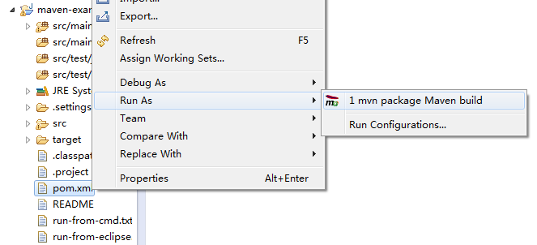
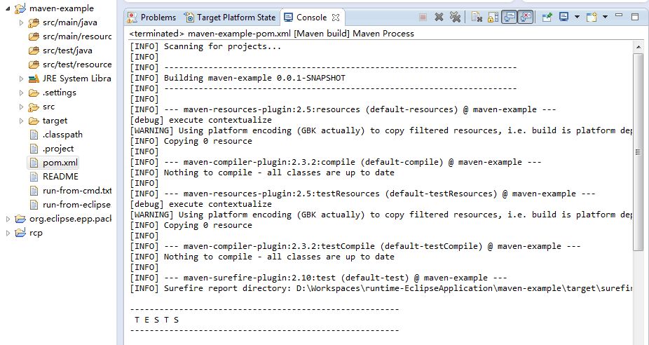

# Enide Maven

This is alternative and completion to m2e (Maven Eclipse Integration).

Launch build or execute Java class.
Project does not need to be Maven project. Just `pom.xml` would be enough.
(The project may be General, old classic Java, broken Maven or Gradle project.)

No miracles, this plugins just launches `mvn` with options, as you can do from command line.
Full path to maven `mvn.bat` or `mvn` is used, so you can try different versions.
Specify options to `mvn` that will be Workspace-wide.
Executed string is shown is Console, so you can check and learn. 

Hint increase Console buffer size in Preferences -> Run\Debug -> Console.
 and check other preferences there as well.
 
[About 2G in `.m2/repository/.cache/m2e`](http://stackoverflow.com/questions/16442292/cleaning-maven-m2e-cache-directory) 
 
## org.nodeclipse.enide.maven

- pom.xml Run As `mvn package` Maven build
- *.java Run As `mvn compile exec:java -Dexec.mainClass=package.Class`

Minisite <http://www.nodeclipse.org/enide/maven/>
GitHub <https://github.com/Nodeclipse/nodeclipse-1/tree/master/org.nodeclipse.enide.maven>

[#117 Run Maven, Gradle or other batch-based script from Java (and then Eclipse)](https://github.com/Nodeclipse/nodeclipse-1/issues/117)

Depends on JDT (see link 1).

### Tomcat start

@since 0.11

Check [Apache Tomcat Maven Plugin](http://tomcat.apache.org/maven-plugin) page.

Version 2.2 is release in Nov 2013. http://tomcat.apache.org/maven-plugin-2.2/index.html

    <pluginManagement>
      <plugins>
        <plugin>
          <groupId>org.apache.tomcat.maven</groupId>
          <artifactId>tomcat6-maven-plugin</artifactId>
          <version>2.2</version>
        </plugin>
        <plugin>
          <groupId>org.apache.tomcat.maven</groupId>
          <artifactId>tomcat7-maven-plugin</artifactId>
          <version>2.2</version>
        </plugin>
      </plugins>
    </pluginManagement>
    
[Only for Tomcat6 there is goal `:start`](http://tomcat.apache.org/maven-plugin-2.2/context-goals.html)   

	mvn tomcat6:start
	
[Tomcat version differences](http://tomcat.apache.org/whichversion.html)	 
	
#### Status

	[INFO] --- tomcat6-maven-plugin:2.2:start (default-cli) @ mavenwar ---
	[INFO] Starting application at http://localhost:8080/mavenwar
	SLF4J: Failed to load class "org.slf4j.impl.StaticLoggerBinder".
	SLF4J: Defaulting to no-operation (NOP) logger implementation
	SLF4J: See http://www.slf4j.org/codes.html#StaticLoggerBinder for further details.
	[INFO] ------------------------------------------------------------------------
	[INFO] BUILD FAILURE
	[INFO] ------------------------------------------------------------------------
	[INFO] Total time: 34.560s
	[INFO] Finished at: Fri Feb 14 22:46:16 CST 2014
	[INFO] Final Memory: 8M/21M
	[INFO] ------------------------------------------------------------------------
	[ERROR] Failed to execute goal org.apache.tomcat.maven:tomcat6-maven-plugin:2.2:start (default-cli) on project mavenwar: Cannot invoke Tomcat manager: Connection refused: connect -> [Help 1]
	

### Jetty start

@since 0.11

For Jetty 7-8 <https://wiki.eclipse.org/Jetty/Feature/Jetty_Maven_Plugin>
For Jetty 9 onward <http://www.eclipse.org/jetty/documentation/current/jetty-maven-plugin.html>
 **You need to use Maven 3 and Java 1.7 for this plugin.**
 mvn -Djetty.port=9999 jetty:run

First, add jetty-maven-plugin to your pom.xml definition:

	<plugin>
	  <groupId>org.eclipse.jetty</groupId>
	  <artifactId>jetty-maven-plugin</artifactId>
	  <version>${jetty-maven-plugin.version}</version>
	</plugin>

Then, from the same directory as your root pom.xml, type:

	mvn jetty:run

This starts Jetty and serves up your project on http://localhost:8080/.

Jetty continues to run until you stop it. While it runs, it periodically scans for changes to your project files,
 so if you save changes and recompile your class files, Jetty redeploys your webapp,
 and you can instantly test the changes you just made.

### Developing with PDE

`git clone`, import this project and `org.nodeclipse.coomon` (only 2 is enough) in Eclipse with PDE (e.g. Eclipse SDK/Classic)
 as "Existing Projects into Workspace".

From plugin.xml form click Run as Eclipse application.

If memory is not enough (getting `java.lang.OutOfMemoryError: PermGen space` error when when running or debugging),
 change in launch configuration for Eclipse Application -> Arguments -> VM Arguments

	-Dosgi.requiredJavaVersion=1.6 -Xms128m -Xmx784m -XX:MaxPermSize=128m -Xss2m

Maven build is optional for full build with other plugins.

#### Links

1. <http://stackoverflow.com/questions/775709/eclipse-pde-navigator-view-treeselection-obtaining-the-file-type-and-name>

### Idea

java-run-javac&java -> bad idea

### DONE

1)

What is gradle analog for maven compile and run
`mvn compile exec:java -Dexec.mainClass=example.Example`

2)

When executing Java class using maven from within Java ([Eclipse plugin actualy](https://github.com/Nodeclipse/nodeclipse-1/tree/master/org.nodeclipse.enide.maven))
`-Dexec.mainClass=maven.MainClass` becomes `maven.MainClass`

	package maven;
	
	public class MainClass {
		public static void main(String[] args) {
			System.out.println("app is running!");
		}
	}

from Eclipse using 

		Process p = DebugPlugin.exec(cmds, workingPath, envp);
		RuntimeProcess process = (RuntimeProcess)DebugPlugin.newProcess(launch, p, MavenConstants.PROCESS_MESSAGE);

for process

D:\Code\springsource\3.0\apache-maven-3.0.3\bin\mvn.bat compile exec:java -Dexec.mainClass=maven.MainClass 

	[INFO] Scanning for projects...
	[INFO]                                                                         
	[INFO] ------------------------------------------------------------------------
	[INFO] Building org.example.maven 0.0.1-SNAPSHOT
	[INFO] ------------------------------------------------------------------------
	[INFO] ------------------------------------------------------------------------
	[INFO] BUILD FAILURE
	[INFO] ------------------------------------------------------------------------
	[INFO] Total time: 0.672s
	[INFO] Finished at: Fri Jan 24 23:59:50 CST 2014
	[INFO] Final Memory: 4M/15M
	[INFO] ------------------------------------------------------------------------
	[ERROR] Unknown lifecycle phase "maven.MainClass". You must specify a valid lifecycle phase or a goal in the format <plugin-prefix>:<goal> or <plugin-group-id>:<plugin-artifact-id>[:<plugin-version>]:<goal>. Available lifecycle phases are: validate, initialize, generate-sources, process-sources, generate-resources, process-resources, compile, process-classes, generate-test-sources, process-test-sources, generate-test-resources, process-test-resources, test-compile, process-test-classes, test, prepare-package, package, pre-integration-test, integration-test, post-integration-test, verify, install, deploy, pre-site, site, post-site, site-deploy, pre-clean, clean, post-clean. -> [Help 1]
	[ERROR] 
	[ERROR] To see the full stack trace of the errors, re-run Maven with the -e switch.
	[ERROR] Re-run Maven using the -X switch to enable full debug logging.
	[ERROR] 
	[ERROR] For more information about the errors and possible solutions, please read the following articles:
	[ERROR] [Help 1] http://cwiki.apache.org/confluence/display/MAVEN/LifecyclePhaseNotFoundException

but from cmd shell using `mvn` or full filename is OK

	D:\Progs\Enide-Monster-08-kepler-win32\runtime-EclipseApplication\org.example.maven>mvn compile exec:java -Dexec.mainClass=maven.MainClass
	[INFO] Scanning for projects...
	[INFO]
	[INFO] ------------------------------------------------------------------------
	[INFO] Building org.example.maven 0.0.1-SNAPSHOT
	[INFO] ------------------------------------------------------------------------
	[INFO]
	[INFO] --- maven-resources-plugin:2.4.3:resources (default-resources) @ org.example.maven ---
	[WARNING] Using platform encoding (Cp1251 actually) to copy filtered resources, i.e. build is platform dependent!
	[INFO] Copying 0 resource
	[INFO]
	[INFO] --- maven-compiler-plugin:2.3.2:compile (default-compile) @ org.example.maven ---
	[INFO] Nothing to compile - all classes are up to date
	[INFO]
	[INFO] >>> exec-maven-plugin:1.2.1:java (default-cli) @ org.example.maven >>>
	[INFO]
	[INFO] <<< exec-maven-plugin:1.2.1:java (default-cli) @ org.example.maven <<<
	[INFO]
	[INFO] --- exec-maven-plugin:1.2.1:java (default-cli) @ org.example.maven ---
	app is running!
	[INFO] ------------------------------------------------------------------------
	[INFO] BUILD SUCCESS
	[INFO] ------------------------------------------------------------------------
	[INFO] Total time: 1.342s
	[INFO] Finished at: Fri Jan 24 23:56:41 CST 2014
	[INFO] Final Memory: 5M/15M
	[INFO] ------------------------------------------------------------------------
	
	
	D:\Progs\Enide-Monster-08-kepler-win32\runtime-EclipseApplication\org.example.maven>D:\Code\springsource\3.0\apache-maven-3.0.3\bin\mvn.bat compile exec:java -Dexec.mainClass=maven
	.MainClass
	[INFO] Scanning for projects...
	[INFO]
	[INFO] ------------------------------------------------------------------------
	[INFO] Building org.example.maven 0.0.1-SNAPSHOT
	[INFO] ------------------------------------------------------------------------
	[INFO]
	[INFO] --- maven-resources-plugin:2.4.3:resources (default-resources) @ org.example.maven ---
	[WARNING] Using platform encoding (Cp1251 actually) to copy filtered resources, i.e. build is platform dependent!
	[INFO] Copying 0 resource
	[INFO]
	[INFO] --- maven-compiler-plugin:2.3.2:compile (default-compile) @ org.example.maven ---
	[INFO] Nothing to compile - all classes are up to date
	[INFO]
	[INFO] >>> exec-maven-plugin:1.2.1:java (default-cli) @ org.example.maven >>>
	[INFO]
	[INFO] <<< exec-maven-plugin:1.2.1:java (default-cli) @ org.example.maven <<<
	[INFO]
	[INFO] --- exec-maven-plugin:1.2.1:java (default-cli) @ org.example.maven ---
	app is running!
	[INFO] ------------------------------------------------------------------------
	[INFO] BUILD SUCCESS
	[INFO] ------------------------------------------------------------------------
	[INFO] Total time: 1.435s
	[INFO] Finished at: Fri Jan 24 23:57:46 CST 2014
	[INFO] Final Memory: 5M/15M
	[INFO] ------------------------------------------------------------------------
	
	