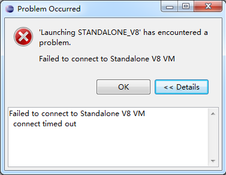

Title:  Nodeclipse Help - Debug  

## Debugging

Right-click `.js` file with Node.js app and select "Debug As -> Node Application" (similar to Java applications).

Notice that Nodeclipse by default enters step-by-step debugging mode from very first line.
 Press <kbd>F8</kbd> to continue until breakpoint is reached.

Press <kbd>F11</kbd> to launch debug [again].

### debug-brk option

By default Nodeclipse stops on the first line when debugging. The cause is that V8 remote debugger needs some time (~100ms)
 to connect to Node.js and get actual modules loaded in V8.

Since Nodeclipse 0.6 there is option "Node debug no -break:" in Preferences to disable interruption at first line.
It is good when your application is web server and you don't need to debug initialization lines, but mostly request handlers. 

From [Node wiki](https://github.com/joyent/node/wiki/Using-Eclipse-as-Node-Applications-Debugger)

> There are 2 debug related node options:

> 	node --debug[=port] NodeApp.js
	
>	node --debug-brk[=port] NodeApp.js

> The `--debug` option will just enable remote debugger connection on given port and then start the application normally.
 Even when debugger is connected to the running node instance later on, the script execution will not be stopped until
 “Suspend” command is issued by Eclipse debugger. Another way to stop the execution is to browse the source code of the
 JavaScript modules comprising the application and double click on the line number at the desired position in script to 
 break at (most likely a callback). Once execution stops you can set/clear more breakpoints, but also inspect call stack
 and view content of all program variables.

> The `--debug-brk` option is needed when your script is short lived (no time to attach debugger) and/or you want to observe 
the NodeApp.js execution from the very start. This option will force execution to break at the first line of the main script 
and wait for debugger to connect. The behavior upon connection is now different – the script is suspended and no breakpoints are set. 
Note that V8 engine debugger is not behaving very good when it steps over or steps into require() method (it will crash), 
so try to set up first breakpoint past the initial module loading. This will also enable you to set breakpoints in any of those modules as well.

That is, when `--debug` is used, than small apps and the beginning of an application are unable to debug.
You will get "Failed to connect to Standalone V8 VM" error, when the app has already finished.

### "Failed to connect to Standalone V8 VM"

There were other reasons reported, when getting "Failed to connect to Standalone V8 VM" error.
Check <http://www.nodeclipse.org/#support>

### Sources

Check [LaunchConfigurationDelegate.java](https://github.com/Nodeclipse/nodeclipse-1/blob/master/org.nodeclipse.debug/src/org/nodeclipse/debug/launch/LaunchConfigurationDelegate.java)
for launching Node.js logic.

### Contribute

<a href="https://github.com/Nodeclipse/nodeclipse-1/blob/master/org.nodeclipse.help/contents/debug.md" target="_blank">Edit online on GitHub</a>
