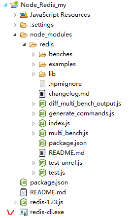

# Redis

[Redis](http://redis.io/) is an open-source, networked, in-memory, key-value data store with optional durability.

Redis as Node.js also runs single-threaded.

Some helpful commands:

- `SET key` and `GET key`
- `KEYS *` list all keys. Not for production environment.
- `EXISTS key`

## node_redis

[node_redis](https://github.com/mranney/node_redis)  is a node.js redis client.

Create new Node.js project, then run `npm install redis --save` in Terminal.



Hint: drap&drop `redis-cli` executable into Eclipse project to create comfortable link (see above).

Example

```javascript
	var redis = require("redis"),
        client = redis.createClient();

    // if you'd like to select database 3, instead of 0 (default), call
    // client.select(3, function() { /* ... */ });

    client.on("error", function (err) {
        console.log("Error " + err);
    });

    client.set("string key", "string val", redis.print);
    client.hset("hash key", "hashtest 1", "some value", redis.print);
    client.hset(["hash key", "hashtest 2", "some other value"], redis.print);
    client.hkeys("hash key", function (err, replies) {
        console.log(replies.length + " replies:");
        replies.forEach(function (reply, i) {
            console.log("    " + i + ": " + reply);
        });
        client.quit();
    });
```    

### Contribute

<a href="https://github.com/Nodeclipse/nodeclipse-1/blob/master/org.nodeclipse.help/contents/node_redis.md" target="_blank">Edit online on GitHub</a>
	